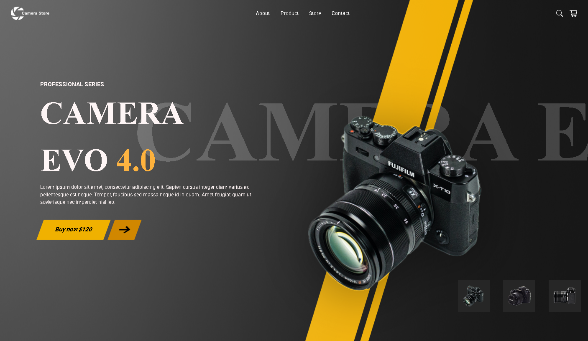

# Camera-Evo-4.0

Desktop

## Projeto
Este projeto tem como objetivo o desenvolvimento de um site no formato utilizando o Framework Tailwind CSS, transformando um design da ferramenta Figma, em um projeto HTML, como parte de uma atividade final do 1°Bimestre da matéria de Linguagem de Marcação na Instituição SENAI Jandira.

## Site
O site se apresenta no formato Landing Page e tem como objetivo principal sua grande capacidade para Responsividade, podendo ser adaptável a telas como: Desktop, Tablet e Celular. A Landing Page apresenta Um anúncio online da Câmera Evo 4.0 que contém:
-  Um Header com a Logo da empresa, links e ícones;
- Uma foto da câmera principal, junto a uma listra e letras no fundo chamando atenção;
- Um título, informações adicionais e um botão de compra contendo o preço da câmera;
- Por último, contém anúncios menores no canto da tela de outras câmeras a venda com um hover.

Clique [AQUI](https://www.figma.com/design/m1TASJxvbCqFDivkKyQJK7/lima-atividade-camera--Copy-?node-id=0-1&p=f&t=WvXgrsX24GBLhcA3-0) para ver o design na plataforma Figma.

## Tecnologias
- HTML
- TAILWIND CSS
- GIT

## Autor
Feito por [David Lucas](https://www.linkedin.com/in/david-lucas-19370727b/)

